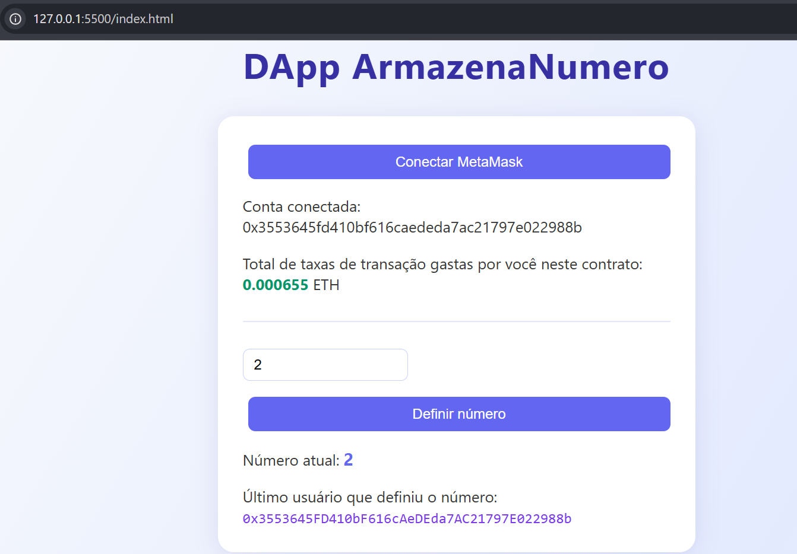

# DApp ArmazenaNumero

Uma DApp (Aplicação Descentralizada) moderna, completa e didática que permite armazenar e ler números na blockchain Ethereum, com recursos avançados de transparência e usabilidade.

---

## Visual da Aplicação

Veja abaixo como é a interface da DApp rodando no navegador:

<p align="center">
   
</p>

---

## Funcionalidades

- Conectar carteira MetaMask
- Ler número armazenado no contrato inteligente
- Definir novo número na blockchain
- Visualizar o **último usuário** que alterou o número
- Ver o **total de taxas de transação** (gas) já gastas por você neste contrato
- Interface moderna e responsiva
- Feedback visual de transações
- Tratamento de erros amigável

---

## Novas Funcionalidades Avançadas

Esta DApp vai além do básico e implementa recursos raros em projetos acadêmicos, agregando valor, transparência e experiência real de uso Web3:

### 1. Exibir o Último Usuário que Alterou o Número

- A interface mostra o endereço Ethereum do último usuário que alterou o número armazenado.
- Isso é possível graças à função `lerUltimoUsuario()` no smart contract.
- Sempre que alguém define um novo número, o endereço é salvo e exibido na interface.

**Vantagens:**
- Transparência sobre quem fez a última alteração
- Demonstra domínio de manipulação de variáveis de endereço no Solidity
- Útil para auditoria, rastreabilidade e segurança

### 2. Calcular e Exibir o Total de Taxas de Transação Gastas

- O usuário pode ver, em tempo real, quanto de ETH já gastou em taxas de transação (gas) ao interagir com este contrato.
- O cálculo é feito somando todas as taxas das transações enviadas pelo usuário para o contrato, usando leitura de logs e recibos via ethers.js.

**Diferenciais:**
- Métrica rara em DApps básicas
- Mostra domínio de leitura de logs, recibos e manipulação de BigNumber/ETH
- Ajuda o usuário a entender o custo real de uso da blockchain

### 3. Visual Moderno e Experiência de Usuário

- Interface estilizada, responsiva e agradável, com feedback visual e cores modernas.
- Exibição clara das informações mais importantes para o usuário.
- Botões, campos e textos com design profissional.

---

## Estrutura do Projeto

```
dapp-armazena-numero/
│
├── contract/
│   └── ArmazenaNumero.sol      # Smart Contract em Solidity
│
├── assets/
│   └── Page_Transaction.png    # Screenshot da aplicação
│
├── index.html                  # Interface da DApp com CSS integrado
├── app.js                      # Lógica principal da aplicação
├── README.md                   # Este arquivo
└── .gitignore                  # Arquivos ignorados pelo Git
```

## Como Usar

### 1. Instalar MetaMask

1. Acesse [metamask.io](https://metamask.io/)
2. Instale a extensão no seu navegador
3. Crie uma nova carteira ou importe uma existente
4. Importante: Mude para uma rede de teste (Sepolia, Goerli, etc.)

### 2. Obter ETH de Teste

Para fazer transações, você precisa de ETH de teste (gratuito):

- Sepolia Faucet: https://sepoliafaucet.com/
- Goerli Faucet: https://goerlifaucet.com/

### 3. Compilar e Fazer Deploy do Contrato

#### No Remix IDE:

1. Acesse [remix.ethereum.org](https://remix.ethereum.org/)

2. Crie um novo arquivo chamado `ArmazenaNumero.sol`

3. Copie o código do arquivo `contract/ArmazenaNumero.sol`

4. Compilar:
   - Vá na aba "Solidity Compiler" (ícone de S)
   - Selecione a versão 0.8.0 ou superior
   - Clique em "Compile ArmazenaNumero.sol"

5. Deploy:
   - Vá na aba "Deploy & Run Transactions" (ícone de Ethereum)
   - Em "Environment", selecione "Injected Provider - MetaMask"
   - Certifique-se de que sua MetaMask está na rede de teste
   - Clique em "Deploy"
   - Confirme a transação na MetaMask

6. Copiar Endereço:
   - Após o deploy, copie o endereço do contrato (aparece em "Deployed Contracts")
   - Exemplo: 0x1234567890abcdef1234567890abcdef12345678

### 4. Configurar o Frontend

1. Abra o arquivo `app.js`

2. Localize a linha com `enderecoContrato` (linha 41):

```javascript
const enderecoContrato = "0x2675f7C4e1fdC55738BBbEB1235406e024C7A215";
```

3. Substitua pelo endereço do contrato que você copiou do Remix:

```javascript
const enderecoContrato = "0x1234567890abcdef1234567890abcdef12345678";
```

4. Salve o arquivo


### 5. Executar a DApp

#### Opção 1: Live Server (Recomendado)

1. Instale a extensão "Live Server" no VS Code
2. Clique com botão direito em `index.html`
3. Selecione "Open with Live Server"
4. A DApp abrirá automaticamente no navegador

#### Opção 2: Servidor HTTP Python

```bash
python -m http.server 8000
```

Acesse: http://localhost:8000

#### Opção 3: Abrir Diretamente

Simplesmente abra o arquivo `index.html` no navegador (pode ter limitações de CORS)

## Testando a DApp

### Fluxo Completo

1. Abrir a DApp no navegador
2. Clicar em "Conectar MetaMask"
   - Aprovar a conexão na MetaMask
   - Sua conta aparecerá na tela
   - O total de taxas gastas será calculado e exibido
3. Ver o número inicial (deve ser 0)
4. Ver o último usuário (deve ser 0x0000000000000000000000000000000000000000 se ninguém definiu ainda)
5. Digitar um novo número (ex: 42)
6. Clicar em "Definir Número"
   - Confirmar a transação na MetaMask
   - Aguardar a mineração (alguns segundos)
   - Alerta de sucesso aparecerá
7. Ver o número atualizado para 42
8. Ver seu endereço como último usuário
9. Ver o total de taxas gastas atualizado

Se tudo isso funcionar, sua DApp está correta!

## Tecnologias Utilizadas

- Solidity ^0.8.0 - Linguagem do smart contract
- Remix IDE - Compilação e deploy
- HTML5 - Estrutura da interface
- CSS3 - Estilização moderna com gradientes
- JavaScript (ES6+) - Lógica da aplicação
- ethers.js v5.7.2 - Biblioteca para interação com Ethereum
- MetaMask - Carteira Web3

## Detalhes Técnicos e Explicações

### Smart Contract

O contrato `ArmazenaNumero.sol` possui:

- Variável privada: `uint256 numero` - armazena o número definido
- Variável privada: `address ultimoUsuario` - armazena o endereço do último usuário que alterou o número
- Função de escrita: `definirNumero(uint256 _novoNumero)` - atualiza o número e o último usuário
- Função de leitura: `lerNumero() returns (uint256)` - retorna o número atual
- Função de leitura: `lerUltimoUsuario() returns (address)` - retorna o último usuário

**Código do contrato:**

```solidity
// SPDX-License-Identifier: MIT
pragma solidity ^0.8.0;

contract ArmazenaNumero {
    uint256 private numero;
    address private ultimoUsuario;
    event NumeroDefinido(address usuario, uint256 novoNumero);

    function definirNumero(uint256 _novoNumero) public {
        numero = _novoNumero;
        ultimoUsuario = msg.sender;
        emit NumeroDefinido(msg.sender, _novoNumero);
    }

    function lerNumero() public view returns (uint256) {
        return numero;
    }

    function lerUltimoUsuario() public view returns (address) {
        return ultimoUsuario;
    }
}
```

### Frontend

A aplicação frontend possui:

- Sem frameworks - JavaScript puro
- ethers.js v5.7.2 via CDN - Não precisa de npm/node
- HTML e CSS integrados em um único arquivo
- Responsivo - Funciona em mobile e desktop
- Tratamento de erros - Mensagens amigáveis via alert
- Feedback visual - Alertas de sucesso e erro
- Exibe o último usuário que alterou o número
- Calcula e exibe o total de taxas de gas gastas pelo usuário
- Visual moderno com gradiente e estilização profissional
- Recarga automática ao trocar de conta ou rede na MetaMask

**Principais funcionalidades do app.js:**

- Conexão com MetaMask via `window.ethereum`
- Criação de instância do contrato com ABI completo
- Leitura de dados do contrato (número e último usuário)
- Envio de transações para definir novo número
- Cálculo de taxas de gas através de leitura de logs e recibos
- Listeners para mudanças de conta e rede

## Dúvidas Frequentes (Troubleshooting)

### MetaMask não conecta

- Verifique se a extensão está instalada e desbloqueada
- Tente recarregar a página
- Limpe o cache do navegador

### Transação falha

- Verifique se tem ETH suficiente para gas
- Confirme que está na rede correta
- Verifique se o endereço do contrato está correto

### Número não atualiza

- Aguarde a confirmação da transação
- Verifique no console do navegador (F12) se há erros
- Tente recarregar a página após a transação

### Erro "Contrato não configurado"

- Certifique-se de ter feito o deploy do contrato
- Verifique se copiou o endereço correto em `app.js`
- O endereço deve ter 42 caracteres (incluindo o 0x)

## Autor:

Matheus Scapolan

- [Linkedin](https://www.linkedin.com/in/matheusscapolan/)
- [GitHub](https://github.com/MatheusScapolan)